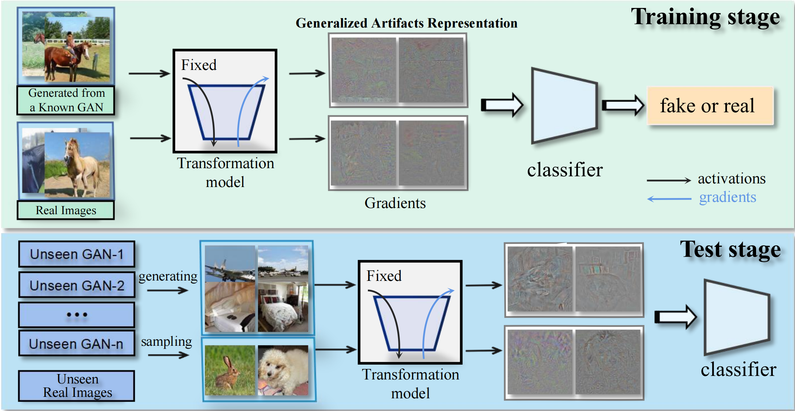

# Learning on Gradients: Generalized Artifacts Representation for GAN-Generated Images Detection

<p align="center">
	<br>
	Beijing Jiaotong University, YanShan University
</p>



Reference github repository for the paper [Learning on Gradients: Generalized Artifacts Representation for GAN-Generated Images Detection](https://openaccess.thecvf.com/content/CVPR2023/papers/Tan_Learning_on_Gradients_Generalized_Artifacts_Representation_for_GAN-Generated_Images_Detection_CVPR_2023_paper.pdf). Tan CC et al., proceedings of the IEEE/CVF CVPR 2023 . If you use our code, please cite our paper:
```
@inproceedings{tan2023learning,
  title={Learning on Gradients: Generalized Artifacts Representation for GAN-Generated Images Detection},
  author={Tan, Chuangchuang and Zhao, Yao and Wei, Shikui and Gu, Guanghua and Wei, Yunchao},
  booktitle={Proceedings of the IEEE/CVF Conference on Computer Vision and Pattern Recognition},
  pages={12105--12114},
  year={2023}
}
```
### Update
- **2023.08.17** The Gradient data is released. [Baidu drive](https://pan.baidu.com/s/1Wmu6YgGPtcOOLRZeSTOjBw?pwd=xf8u)
- **2023.08.17** The Pytorch version of img2grad is released.


## Environment setup
**Img2grad environment:** 
We suggest transforming the image into a gradient using the tensorflow environment in docker image `nvcr.io/nvidia/tensorflow:21.02-tf1-py3` from [nvidia](https://catalog.ngc.nvidia.com/orgs/nvidia/containers/tensorflow/tags).

**Classification environment:** 
We recommend installing the required packages by running the command:
```sh
pip install -r requirements.txt
```

## Getting the data
Download dataset from [CNNDetection](https://github.com/peterwang512/CNNDetection).
## Transform Image to Gradients
1. Download pretrained model of [stylegan](https://github.com/NVlabs/stylegan), and put this `<project dir>/img2grad/stylegan/networks/`. Or run using
```sh
mkdir -p ./img2gad/stylegan/networks
wget https://lid-1302259812.cos.ap-nanjing.myqcloud.com/tmp/karras2019stylegan-bedrooms-256x256.pkl -O ./img2gad/stylegan/networks/karras2019stylegan-bedrooms-256x256.pkl
```
2. Run using
```sh
sh ./transform_img2grad.sh {GPU-ID} {Data-Root-Dir} {Grad-Save-Dir}
```

## Training the model 
```sh
sh ./train-detector.sh {GPU-ID} {Grad-Save-Dir}
```

## Testing the detector
Download all pretrained weight files from<https://drive.google.com/drive/folders/17-MAyCpMqyn4b_DFP2LekrmIgRovwoix?usp=share_link>.
```sh
cd CNNDetection
CUDA_VISIBLE_DEVICES=0 python eval_test8gan.py --model_path {Model-Path}  --dataroot {Grad-Test-Path} --batch_size {BS}
```

## Acknowledgments

This repository borrows partially from the [CNNDetection](https://github.com/peterwang512/CNNDetection), [stylegan](https://github.com/NVlabs/stylegan), and [genforce](https://github.com/genforce/genforce/).
